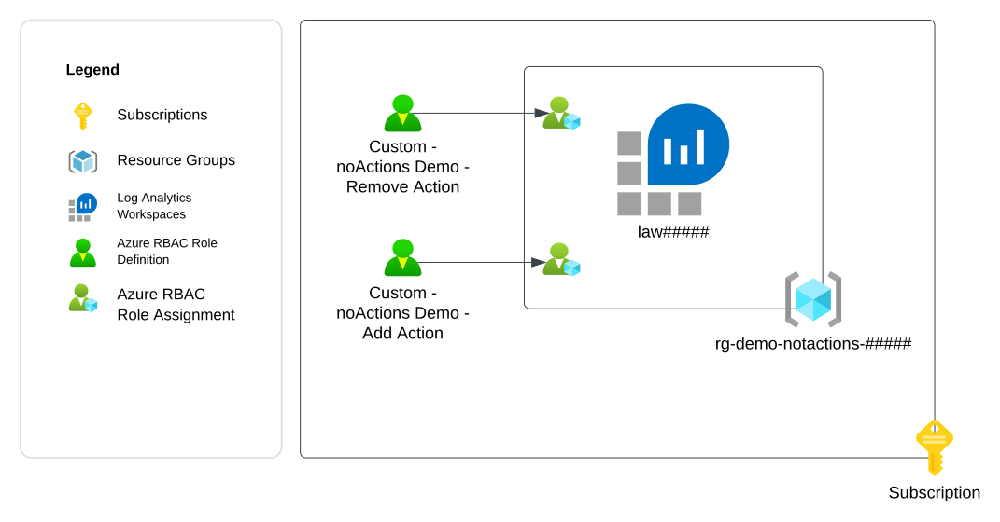
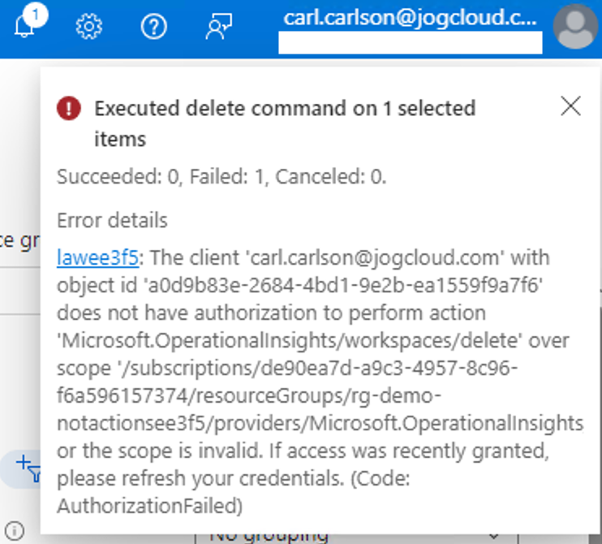

# Exercise 1 - Demonstrating notActions

## Updates
12/11/2023 - Initial release

## Overview
In this exercise you will demonstrate how [Azure RBAC permissions](https://learn.microsoft.com/en-us/azure/role-based-access-control/role-definitions) follow a cumulative most permissive model when using only actions, notActions, dataActions, and notDataActions. 

You will demonstrate this by assigning a user two role assignments for custom roles that provide permissions on an Azure Log Analytics Workspace. One role grants all management plane permissions on the Microsoft.OperationalInsights resource provider but uses notActions to remove the permission to delete a Log Analytics Workspace. The second role grants the delete permission.

The desired outcome is the user is able to delete the Log Analytics Workspaces when both roles are assigned to user demonstrating that notActions is not an explicit deny.

The exercise will create the resources illustrated below.



## Pre-requisites
1. You must have an Azure Subscription.

2. You must hold the Owner role on the Azure subscription. This is required because you will be creating role assignments and [registering resource providers](https://learn.microsoft.com/en-us/azure/azure-resource-manager/management/resource-providers-and-types).

3. You must have [Azure CLI](https://learn.microsoft.com/en-us/cli/azure/install-azure-cli) or [Azure PowerShell](https://learn.microsoft.com/en-us/powershell/azure/install-azure-powershell?view=azps-11.1.0) installed. 

    The commands used throughout the exercise using Azure CLI assume the commands are being run from a Bash shell. If using Windows, you can use a Bash shell using the [Windows Subsystem for Linux](https://learn.microsoft.com/en-us/windows/wsl/about).

4. You must create another user in the Entra ID tenant. This will be referred to as the **Demo User** and will be used throughout the exercises. Actions that require the **Demo User** will be labeled as a Demo User action. All other actions should be performed by your user identity that holds the Owner role on the subscription. You will need to record the user principal name of the user identity that you create.

5. You must [assign the **Demo User**](https://learn.microsoft.com/en-us/azure/role-based-access-control/role-assignments-steps) the [Reader role](https://learn.microsoft.com/en-us/azure/role-based-access-control/built-in-roles#reader) at the subscription scope where the resources for this exercise will be deployed.

6. You must be able to login into the Azure Portal and Azure CLI or Azure PowerShell as the **Demo User**.

7. You must define the following variables before running any of the commands in this exercise:
    * **subscription_id** - This is the subscription id the resources will be deployed to. You can obtain the subscription id using the command line options below:

        *Azure CLI*
        ```
        subscription_id=$(az account show --name YOUR_SUBSCRPITION_NAME --query id --output tsv)
        ```
        *Azure PowerShell*
        ```
        $subscription_id=(Get-AzSubscription -SubscriptionName YOUR_SUBSCRIPTION_NAME).SubscriptionId 
        ```

    * **user_object_id** - This is the object id of the Demo User user identity you will use in the exercise. You will need the user principal name for the user you created or requested be created for you prior to starting this exercise. You can obtain the user's object id using the command line options below:

        *Azure CLI*
        ```
        user_object_id=$(az ad user show --id DEMO_USER_UPN --query id --output tsv)
        ```
        *Azure PowerShell*
        ```
        $user_object_id=(Get-AzADUser -UserPrincipalName DEMO_USER_UPN).Id
        ```

    * **location** - This is the location the resources will be deployed to. You can obtain a list of regions available for deployment using the commands below. Ensure that there is no Azure Policy in the Entra ID tenant preventing you from deploying to the selected region.
    
        *Azure CLI*
        ```
        az account list-locations --query "[].name"
        ```

        *Azure PowerShell*
        ```
        get-azlocation | Select-Object -ExpandProperty Location 
        ```

## Environment Setup
1. Generate a unique GUID to be used throughout the demo.

    *Azure CLI*
    ```
    unique_guid="$(uuidgen)"
    unique_guid_short=$(echo "${unique_guid::5}" | awk '{print tolower($0)}')
    ```
    *Azure PowerShell*
    ```
    $unique_guid=([guid]::NewGuid()).Guid
    $unique_guid_short=$unique_guid.Substring(0,5) 
    ```

2. Set variables for the resource names.

    *Azure CLI*
    ```
    law_name="law${unique_guid_short}"
    resource_group_name="rg-demo-rbac-notactions${unique_guid_short}"
    ```
    *Azure PowerShell*
    ```
    $law_name = "law" + $unique_guid_short 
    $resource_group_name = "rg-demo-rbac-notactions" + $unique_guid_short
    ```

3. Open a Bash shell or PowerShell shell and log into Azure using Azure CLI or Azure PowerShell.

    *Azure CLI*
    ```
    az login
    ```

    *Azure PowerShell*
    ```
    Login-AzAccount
    ```

4. Set the appropriate subscription context.

    *Azure CLI*
    ```
    az account set --id YOUR_SUBSCRIPTION_NAME
    ```
    *Azure PowerShell*
    ```
    Set-AzContext -Subscription YOUR_SUBSCRIPTION_NAME
    ```

5. Create a resource group.
    
    *Azure CLI*
    ```
    az group create --name $resource_group_name --location $location
    ```

    *Azure PowerShell*
    ```
    New-AzResourceGroup -Name $resource_group_name -Location $location 
    ```

6. Create a Log Analytics Workspace.

    *Azure CLI*
    ```
    az monitor log-analytics workspace create --resource-group $resource_group_name \
    --workspace-name $law_name --location $location
    ```

    *Azure PowerShell*
    ```
    New-AzOperationalInsightsWorkspace -Name $law_name `
    -ResourceGroupName $resource_group_name `
    -Location $location
    ```

7. Create a custom role definition that allows all operations for a Log Analytics Workspace but removes the delete permission.

    *Azure CLI*
    ```
    notaction_role_name=$(az role definition create --role-definition '{
        "Name": "Custom - notActions Demo - Remove action",
        "Description": "Custom role that demonstrates notActions. This role uses a notAction to remove the delete action from a Log Analytics Workspace.",
        "Actions": [
            "Microsoft.OperationalInsights/*"
        ],
        "notActions": [
            "Microsoft.OperationalInsights/workspaces/delete"
        ],
        "DataActions": [
        ],
        "NotDataActions": [
        ],
        "AssignableScopes": [
            "/subscriptions/'$subscription_id'"
        ]
    }' \
    --query roleName --output tsv)
    ```

    When running the commands below, you should give it one minute before fetching the custom role to allow the role propagation to replicate across Entra ID.

    *Azure PowerShell*
    ```
    $custom_role = Get-AzRoleDefinition -Name "Reader"
    $custom_role.Id = $null
    $custom_role.Name = "Custom - notActions Demo - Remove Action"
    $custom_role.IsCustom = $True
    $custom_role.Description = "Custom role that demonstrates notActions. This role uses a notAction to remove the delete action from a Log Analytics Workspace."
    $custom_role.Actions.Clear()
    $custom_role.Actions.Add("Microsoft.OperationalInsights/*")
    $custom_role.NotActions.Clear()
    $custom_role.NotActions.Add("Microsoft.OperationalInsights/workspaces/delete")
    $custom_role.DataActions.Clear()
    $custom_role.NotDataActions.Clear()
    $custom_role.AssignableScopes.Clear()
    $custom_role.AssignableScopes.Add("/subscriptions/$($subscription_id)")

    New-AzRoleDefinition -Role $custom_role 

    $notaction_role_name=(Get-AzRoleDefinition -Name "Custom - notActions Demo - Remove Action").Name
    ``` 

8. Create a custom role definition that allows the delete operation on Log Analytics Workspaces.

    *Azure CLI*
    ```
    action_role_name=$(az role definition create --role-definition '{
        "Name": "Custom - notActions Demo - Add Action",
        "Description": "Custom role that demonstrates notActions. This role grants the delete action from a Log Analytics Workspace.",
        "Actions": [
       "Microsoft.OperationalInsights/workspaces/delete"
        ],
        "notActions": [
        ],
        "DataActions": [
        ],
        "NotDataActions": [
        ],
        "AssignableScopes": [
            "/subscriptions/'$subscription_id'"
        ]
    }' \
    --query roleName --output tsv)
    ```
    When running the commands below, you should give it one minute before fetching the custom role to allow the role propagation to replicate across Entra ID.
    
    *Azure PowerShell*
    ```
    $custom_role = Get-AzRoleDefinition -Name "Reader"
    $custom_role.Id = $null
    $custom_role.Name = "Custom - notActions Demo - Add Action"
    $custom_role.IsCustom = $True
    $custom_role.Description = "Custom role that demonstrates notActions. This role grants the delete action from a Log Analytics Workspace."
    $custom_role.Actions.Clear()
    $custom_role.Actions.Add("Microsoft.OperationalInsights/workspaces/delete")
    $custom_role.NotActions.Clear()
    $custom_role.DataActions.Clear()
    $custom_role.NotDataActions.Clear()
    $custom_role.AssignableScopes.Clear()
    $custom_role.AssignableScopes.Add("/subscriptions/$($subscription_id)")

    New-AzRoleDefinition -Role $custom_role 

    $action_role_name=(Get-AzRoleDefinition -Name "Custom - notActions Demo - Add Action").Name
    ``` 

9. Create a role assignment for the role that includes the notActions and assign it to the demo user.

    *Azure CLI*
    ```
    az role assignment create --assignee-object-id $user_object_id \
    --role $notaction_role_name \
    --scope "/subscriptions/$subscription_id/resourceGroups/$resource_group_name" \
    --assignee-principal-type User
    ```
    *Azure PowerShell*
    
    When running the commands below, you should give it one minute before fetching the role assignment to allow the role propagation to replicate across Entra ID.
    ```
    New-AzRoleAssignment -ObjectId $user_object_id -RoleDefinitionName $notaction_role_name -Scope "/subscriptions/$subscription_id/resourceGroups/$resource_group_name"
    ```
Leave the Bash shell or PowerShell shell open. You will use it during the exercise.

## Demo - Demonstrate notActions

1. Log into the Azure Portal. Review the created custom role definition for the role named "Custom - notActions Demo - Remove action". Highlight the presence of the delete permission in the notActions property.

    Log out of the Portal or create a new Icognito instance of the browser.

2. **Demo User Action** Log into the Azure Portal as the **Demo User** Attempt to delete the Log Analytics Workspace. It will fail and you will receive the error below.

    

    The user is unable to delete the Log Analytics Workspace because the delete permission was removed from the set of permissions granted to the user through the use of notActions.

    Close the browser to clear the **Demo User's** session cookies.

3. Create a role assignment for the role that includes the delete action and assign it to the **Demo User**.

    *Azure CLI*
    ```
    az role assignment create --assignee-object-id $user_object_id \
    --role $action_role_name \
    --scope "/subscriptions/$subscription_id/resourceGroups/$resource_group_name" \
    --assignee-principal-type User
    ```
    *Azure PowerShell*
    ```
    New-AzRoleAssignment -ObjectId $user_object_id -RoleDefinitionName $action_role_name -Scope "/subscriptions/$subscription_id/resourceGroups/$resource_group_name"
    ``````

4. Review the created custom role definition for the role named "Custom - notActions Demo - Add action". Highlight the presence of the delete permission in the actions property.

    Wait 2-3 minutes for the new role assignment to replicate through Entra ID.

5. **Demo User Action** Attempt to delete the Log Analytics Workspace.

    The user will be able to successfully deleted the Log Analytics Workspace which demonstrates how permissions are cumulative across roles and notActions is not an explicit deny.

## Cleanup

1. Delete the resource group.

    *Azure CLI*
    ```
    az group delete --name $resource_group_name --yes
    ```
    *Azure PowerShell*
    ```
    Remove-AzResourceGroup $resource_group_name -Force
    ```

2. Delete the custom role definitions using the commands below. The definitions can only be deleted after the resource group is deleted because the resource group has Azure RBAC Role Assignments assigned to it using these roles.
    
    *Azure CLI*
    ```
    az role definition delete --name $notaction_role_name

    az role definition delete --name $action_role_name
    ```
    *Azure PowerShell*
    ```
    Remove-AzRoleDefinition $notaction_role_name -Force

    Remove-AzRoleDefinition $action_role_name -Force 
    ```


