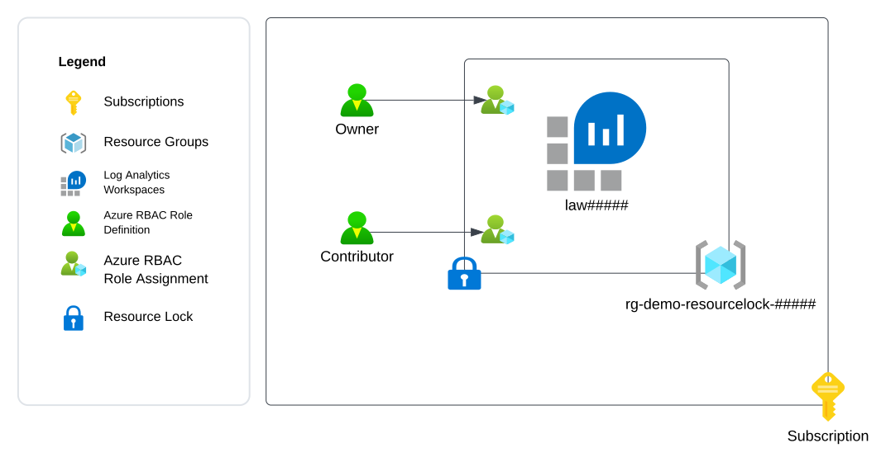
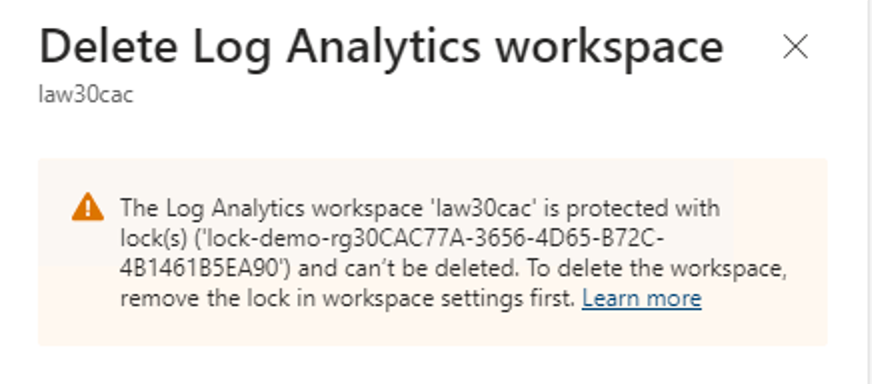
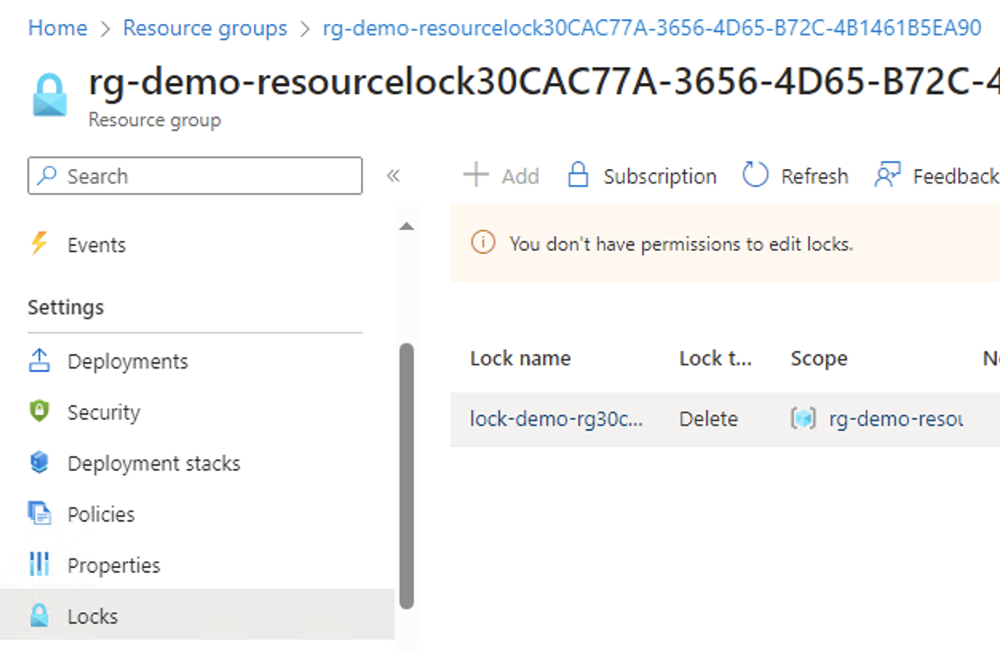

# Exercise 2 - Demonstrating Resource Locks

## Updates
12/11/2023 - Initial release

## Overview
In this exercise you will perform a demonstration of an [Azure Resource Lock](https://learn.microsoft.com/en-us/azure/azure-resource-manager/management/lock-resources?tabs=json).

You observed in [Exercise 1](./exercise1.md) that notActions is not an explicit deny and a user can perform the action if they have the permission from another assigned role. A resource lock can block a user from modifying or deleting a resource even if the user has appropriate permissions on the reosurces to perform those actions.

You will demonstrate how a resource lock can block the deletion of an Azure resource even when the user has appropriate permissions to delete the resource. You will also demonstrate how this control can be circumvented when a user holds privileged permissions.

For the first demonstration, a resource lock will created on a resource group containing a Log Analytics Workspace. The Contributor role will be assigned to a user on the resource group.

The desired outcome is the resource lock will block deletion of the resource. This will illustrate how resource locks can prevent modifications and deletions of Azure resources.

For the second demonstration, the user will be assigned the Owner role over the resource group. This role contains the [privileged permission](https://learn.microsoft.com/en-us/azure/azure-resource-manager/management/lock-resources?tabs=json#who-can-create-or-delete-locks) required to delete a resource lock.

The desired outcome is the user will be able to remove the resource lock and delete the resource. This illustrates the importance of least privilege and the inclusion of [denyAssignments](https://learn.microsoft.com/en-us/azure/role-based-access-control/deny-assignments) and [Azure Policy denyActions](https://techcommunity.microsoft.com/t5/azure-paas-blog/quickstart-denyaction-effect-in-azure-policy/ba-p/3705112) which will be demonstrated in a later demo.

The exercise will create the resources illustrated below.



## Pre-requisites

1. You must have an Azure Subscription.

2. You must hold the Owner role on the Azure subscription. This is required because you will be creating role assignments and [registering resource providers](https://learn.microsoft.com/en-us/azure/azure-resource-manager/management/resource-providers-and-types).

3. You must have [Azure CLI](https://learn.microsoft.com/en-us/cli/azure/install-azure-cli) or [Azure PowerShell](https://learn.microsoft.com/en-us/powershell/azure/install-azure-powershell?view=azps-11.1.0) installed. 

    The commands used throughout the exercise using Azure CLI assume the commands are being run from a Bash shell. If using Windows, you can use a Bash shell using the [Windows Subsystem for Linux](https://learn.microsoft.com/en-us/windows/wsl/about).

4. You must create another user in the Entra ID tenant. This will be referred to as the **Demo User** and will be used throughout the exercises. Actions that require the **Demo User** will be labeled as a Demo User action. All other actions should be performed by your user identity that holds the Owner role on the subscription. You will need to record the user principal name of the user identity that you create.

5. You must [assign the **Demo User**](https://learn.microsoft.com/en-us/azure/role-based-access-control/role-assignments-steps) the [Reader role](https://learn.microsoft.com/en-us/azure/role-based-access-control/built-in-roles#reader) at the subscription scope where the resources for this exercise will be deployed.

6. You must be able to login into the Azure Portal and Azure CLI or Azure PowerShell as the **Demo User**.

7. You must define the following variables before running any of the commands in this exercise:
    * **subscription_id** - This is the subscription id the resources will be deployed to. You can obtain the subscription id using the command line options below:

        *Azure CLI*
        ```
        subscription_id=$(az account show --name YOUR_SUBSCRPITION_NAME --query id --output tsv)
        ```
        *Azure PowerShell*
        ```
        $subscription_id=(Get-AzSubscription -SubscriptionName YOUR_SUBSCRIPTION_NAME).SubscriptionId 
        ```

    * **user_object_id** - This is the object id of the Demo User user identity you will use in the exercise. You will need the user principal name for the user you created or requested be created for you prior to starting this exercise. You can obtain the user's object id using the command line options below:

        *Azure CLI*
        ```
        user_object_id=$(az ad user show --id DEMO_USER_UPN --query id --output tsv)
        ```
        *Azure PowerShell*
        ```
        $user_object_id=(Get-AzADUser -UserPrincipalName DEMO_USER_UPN).Id
        ```

    * **location** - This is the location the resources will be deployed to. You can obtain a list of regions available for deployment using the commands below. Ensure that there is no Azure Policy in the Entra ID tenant preventing you from deploying to the selected region.
    
        *Azure CLI*
        ```
        az account list-locations --query "[].name"
        ```
        *Azure PowerShell*
        ```
        Get-AzLocation | Select-Object -ExpandProperty Location 
        ```

## Environment Setup
1. Generate a unique GUID to be used throughout the demo.

    *Azure CLI*
    ```
    unique_guid="$(uuidgen)"
    unique_guid_short=$(echo "${unique_guid::5}" | awk '{print tolower($0)}')
    ```
    *Azure PowerShell*
    ```
    $unique_guid=([guid]::NewGuid()).Guid
    $unique_guid_short=$unique_guid.Substring(0,5) 
    ```

2. Set variables for the resource names.

    *Azure CLI*
    ```
    law_name="law${unique_guid_short}"
    resource_group_name="rg-demo-rbac-resource-lock${unique_guid_short}"
    resource_lock_name="lock-demo-rg${unique_guid_short}"
    ```
    *Azure PowerShell*
    ```
    $law_name = "law" + $unique_guid_short 
    $resource_group_name = "rg-demo-rbac-resource-lock" + $unique_guid_short
    $resource_lock_name = "lock-demo-rg" + $unique_guid_short
    ```

3. Open a Bash shell or PowerShell shell and log into Azure using Azure CLI or Azure PowerShell.

    *Azure CLI*
    ```
    az login
    ```

    *Azure PowerShell*
    ```
    Login-AzAccount
    ```

4. Set the appropriate subscription context.

    *Azure CLI*
    ```
    az account set --id YOUR_SUBSCRIPTION_NAME
    ```
    *Azure PowerShell*
    ```
    Set-AzContext -Subscription YOUR_SUBSCRIPTION_NAME
        ```

5. Create a resource group.
    
    *Azure CLI*
    ```
    az group create --name $resource_group_name --location $location
    ```

    *Azure PowerShell*
    ```
    New-AzResourceGroup -Name $resource_group_name -Location $location
    ```

6. Create a Log Analytics Workspace.

    *Azure CLI*
    ```
    az monitor log-analytics workspace create --resource-group $resource_group_name \
    --workspace-name $law_name --location $location
    ```

    *Azure PowerShell*
    ```
    New-AzOperationalInsightsWorkspace -Name $law_name `
    -ResourceGroupName $resource_group_name `
    -Location $location
    ```

7. Create a resource lock that prevents deletions and assign it to the resource group.

    *Azure CLI*
    ```
    az lock create --name $resource_lock_name \
    --lock-type CanNotDelete \
    --resource-group $resource_group_name
    ```
    *Azure PowerShell*
    ```
    New-AzResourceLock -LockName $resource_lock_name `
    -LockLevel CanNotDelete `
    -ResourceGroupName $resource_group_name -Force

    ```

8. Create a role assignment for the Contributor built-in role and assign it to the Demo User at the resource group scope.

    *Azure CLI*    
    ```
    az role assignment create --assignee-object-id $user_object_id \
    --role "Contributor" \
    --scope "/subscriptions/$subscription_id/resourceGroups/$resource_group_name" \
    --assignee-principal-type "User"
    ```

    *Azure PowerShell*
    ```
     New-AzRoleAssignment -ObjectId $user_object_id `
     -RoleDefinitionName "Contributor" `
     -Scope "/subscriptions/$subscription_id/resourceGroups/$resource_group_name" 

    ```

## Demo 1 - Demonstrate how a resource lock can prevent deletion

1. **Demo User Action** Log into the Azure Portal. Attempt to delete the Log Analytics Workspace. You will receive the error shown below preventing deletion.



The Demo User is unable to delete the Log Analytics Workspace because the resource lock applied at the resource group level is configured to prevent all deletions.

2. **Demo User Action** Navigate to the resource groups and choose Locks from the menu. Attempt to delete the lock.

The Demo User cannot delete the lock because this requires the
Microsoft.Authorization/locks/delete permission which is by default only granted to the User Access Administrator and Owner roles. The Demo User only holds the Contributor role.



## Demo 2 - Demonstrate how a resource lock can be circumvented by a user holding a highly privileged role.

1. Create a role assignment for the Owner built-in role and assign it to the demo user at the resource group scope.
    *Azure CLI*
    ```
    az role assignment create --assignee-object-id $user_object_id \
    --role "Owner" \
    --scope "/subscriptions/$subscription_id/resourceGroups/$resource_group_name" \
    --assignee-principal-type "User"
    ```
    *Azure PowerShell*
    ```
    New-AzRoleAssignment -ObjectId $user_object_id ` -RoleDefinitionName "Owner" `
    -Scope "/subscriptions/$subscription_id/resourceGroups/$resource_group_name" 
    ```

2. **Demo User Action** Ensure 2-3 minutes have passed to allow the role assignmen to replicate across Entra ID. Close the browser you have open. Open the browser again and log back into the Azure Portal.

    Navigate to the resource groups and choose Locks from the menu. Attempt to delete the lock.

    The user can delete the lock because the Owner role has all management plane permissions.

## Cleanup

1. Delete the resource group.

    *Azure CLI*
    ```
    az group delete --name $resource_group_name --yes
    ```
    *Azure PowerShell*
    ```
    Remove-AzResourceGroup -name $resource_group_name -Force
    ```


