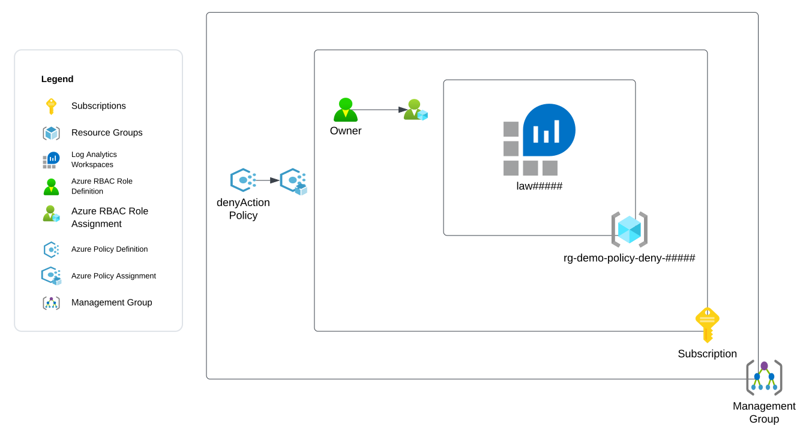
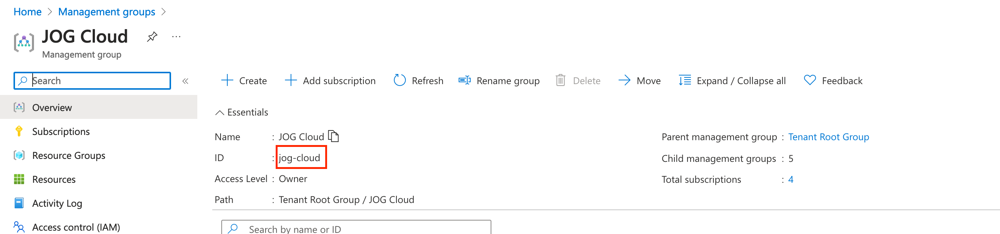
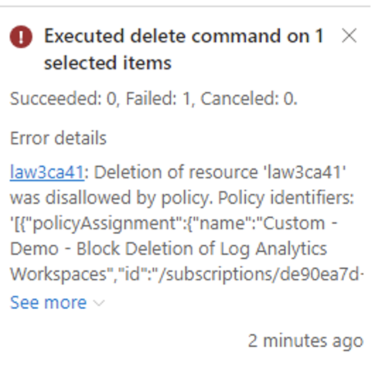
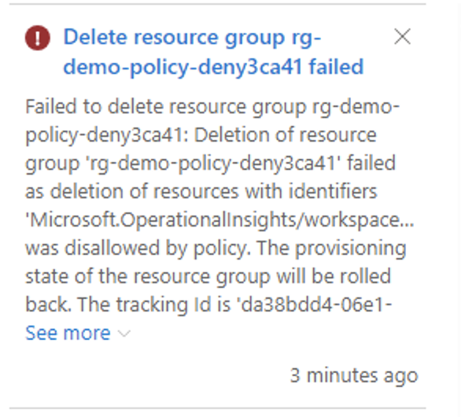
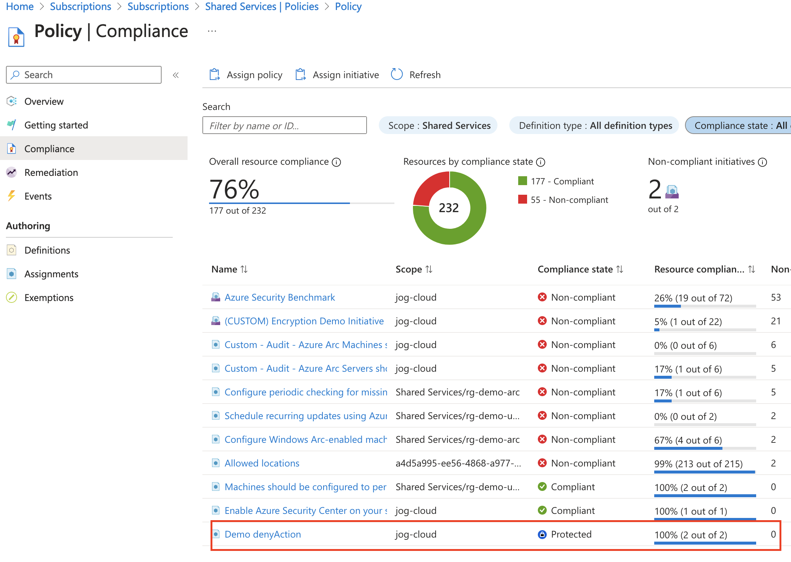
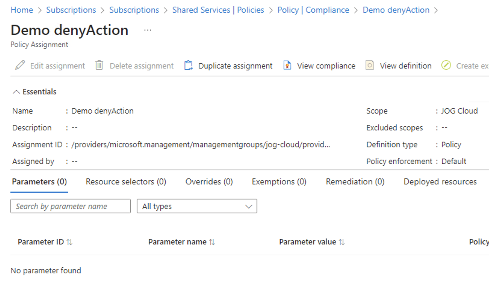

# Exercise 3 - Demonstrating Azure Policy Deny Actions

## Updates
12/11/2023 - Initial release

## Overview

In this exercise you will demonstrate the [Azure Policy effect of denyAction](https://learn.microsoft.com/en-us/azure/governance/policy/concepts/effects#denyaction). 

You observed in [Exercise 1](./exercise1.md) that notActions is not an explicit deny, and a user can perform the action if they have the permission from another assigned role. In [Exercise 2](./exercise2.md) you observed that a user with a privileged permission at the Azure Subscription scope could remove the resource lock allowing the user to circumvent the lock. The Azure Policy effect of denyAction is one way to establish an explicit deny on a resource which can also deny a user with privileged permissions over the subscription from circumventing it.

In this exercise you will create a custom Azure Policy definition with an effect of denyAction that will block the deletion of Log Analytics Workspaces tagged with a key of rbac and a value of prod. The policy will be assigned at the management group scope. A role assignment will be created for a demo user assigning that user the Owner role over the Azure subscription scope.

A resource group and a Log Analytics Workspace will also be created. You will attempt to delete the Log Analytics Workspace with the demo user that is assigned the Owner role at the subscription scope. The desired outcome is the demo user will be blocked by the Azure Policy from deleting the resource. Due to the Azure Policy being assigned at the management group scope, the user will also be unable to circumvent this control.

The exercise will create the resources illustrated below.



## Pre-requisites
1. You must have an Azure Subscription.

2. You must hold the Owner role on the Azure subscription. This is required because you will be creating role assignments and [registering resource providers](https://learn.microsoft.com/en-us/azure/azure-resource-manager/management/resource-providers-and-types).

3. The Azure subscription must be contained within a [Management Group](https://learn.microsoft.com/en-us/azure/governance/management-groups/create-management-group-portal).

4. You must hold the Owner role on the management group which contains the Azure subscription. This is required because you will be assigning an Azure Policy to the management group.

5. You must have [Azure CLI](https://learn.microsoft.com/en-us/cli/azure/install-azure-cli) or [Azure PowerShell](https://learn.microsoft.com/en-us/powershell/azure/install-azure-powershell?view=azps-11.1.0) installed. 

    The commands used throughout the exercise using Azure CLI assume the commands are being run from a Bash shell. If using Windows, you can use a Bash shell using the [Windows Subsystem for Linux](https://learn.microsoft.com/en-us/windows/wsl/about).

6. You must create another user in the Entra ID tenant. This will be referred to as the **Demo User** and will be used throughout the exercises. Actions that require the **Demo User** will be labeled as a Demo User action. All other actions should be performed by your user identity that holds the Owner role on the subscription. You will need to record the user principal name of the user identity that you create.

7. You must [assign the **Demo User**](https://learn.microsoft.com/en-us/azure/role-based-access-control/role-assignments-steps) the [Reader role](https://learn.microsoft.com/en-us/azure/role-based-access-control/built-in-roles#reader) at the subscription scope where the resources for this exercise will be deployed.

8. You must define the following variables before running any of the commands in this exercise:
    * **subscription_id** - This is the subscription id the resources will be deployed to. You can obtain the subscription id using the command line options below:

        *Azure CLI*
        ```
        subscription_id=$(az account show --name YOUR_SUBSCRPITION_NAME --query id --output tsv)
        ```
        *Azure PowerShell*
        ```
        $subscription_id=(Get-AzSubscription -SubscriptionName YOUR_SUBSCRIPTION_NAME).SubscriptionId 
        ```

    * **user_object_id** - This is the object id of the Demo User user identity you will use in the exercise. You will need the user principal name for the user you created or requested be created for you prior to starting this exercise. You can obtain the user's object id using the command line options below:

        *Azure CLI*
        ```
        user_object_id=$(az ad user show --id DEMO_USER_UPN --query id --output tsv)
        ```
        *Azure PowerShell*
        ```
        $user_object_id=(Get-AzADUser -UserPrincipalName DEMO_USER_UPN).Id
        ```

    * **location** - This is the location the resources will be deployed to. You can obtain a list of regions available for deployment using the commands below. Ensure that there is no Azure Policy in the Entra ID tenant preventing you from deploying to the selected region.
    
        *Azure CLI*
        ```
        az account list-locations --query "[].name"
        ```

        *Azure PowerShell*
        ```
        Get-AzLocation | Select-Object -ExpandProperty Location 
        ```

    * **management_group_name** - The name of the management group the Azure Policy definition will be assigned. This is the value in the name property, not the value in the DisplayName property. For example, a management group may have a display name of "My Company" but a name of "my-company".

        If you are unsure as to the value of the name property, you retrieve it  from the Management Group blade in the Azure Portal as seen below.

        

    * **management_group_id** - The resource id of the management group the Azure Policy definition will be created and assigned.

        *Azure CLI*
        ```
        management_group_id=$(az account management-group show --name $management_group_name --query id --output tsv)
        ```
        *Azure PowerShell*
        ```
        $management_group_id = (Get-AzManagementGroup -GroupName $management_group_name).Id
        ```

## Environment Setup
1. Generate a unique GUID to be used throughout the demo.

    *Azure CLI*
    ```
    unique_guid="$(uuidgen)"
    unique_guid_short=$(echo "${unique_guid::5}" | awk '{print tolower($0)}')
    ```
    *Azure PowerShell*
    ```
    $unique_guid=([guid]::NewGuid()).Guid
    $unique_guid_short=$unique_guid.Substring(0,5) 
    ```

2. Set variables for the resource names.

    *Azure CLI*
    ```
    law_name="law${unique_guid_short}"
    resource_group_name="rg-demo-rbac-denyaction${unique_guid_short}"
    policy_name="Custom - Demo - Block Deletion of Log Analytics Workspaces"
    policy_assignment_name="Demo denyAction"
    ```
    *Azure PowerShell*
    ```
    $law_name = "law" + $unique_guid_short 
    $resource_group_name = "rg-demo-rbac-denyaction" + $unique_guid_short
    $policy_name="Custom - Demo - Block Deletion of Log Analytics Workspaces"
    $policy_assignment_name="Demo denyAction"
    ```

3. Open a Bash shell or PowerShell shell and log into Azure using Azure CLI or Azure PowerShell.

    *Azure CLI*
    ```
    az login
    ```

    *Azure PowerShell*
    ```
    Login-AzAccount
    ```

4. Set the appropriate subscription context.

    *Azure CLI*
    ```
    az account set --id YOUR_SUBSCRIPTION_NAME
    ```
    *Azure PowerShell*
    ```
    Set-AzContext -Subscription YOUR_SUBSCRIPTION_NAME
    ```

5. Create a resource group.
    
    *Azure CLI*
    ```
    az group create --name $resource_group_name --location $location
    ```

    *Azure PowerShell*
    ```
    New-AzResourceGroup -Name $resource_group_name -Location $location 
    ```

6. Create a Log Analytics Workspace.

    *Azure CLI*
    ```
    az monitor log-analytics workspace create --resource-group $resource_group_name \
    --workspace-name $law_name --location $location \
    --tags rbac=prod
    ```

    *Azure PowerShell*
    ```
    New-AzOperationalInsightsWorkspace -Name $law_name `
    -ResourceGroupName $resource_group_name `
    -Location $location `
    -Tag @{rbac="prod"}
    ```

7. Create a role assignment for the built-in Owner role and assign it to the Demo User at the subscription scope.

    *Azure CLI*
    ```
    role_assignment=$(az role assignment create --assignee-object-id $user_object_id \
    --role "Owner" \
    --scope "/subscriptions/$subscription_id/resourceGroups/$resource_group_name" \
    --assignee-principal-type User \
    --query id --output tsv)
    ```
    *Azure PowerShell*
    ```
    $role_assignment=(New-AzRoleAssignment -ObjectId $user_object_id -RoleDefinitionName "Owner" -Scope "/subscriptions/$subscription_id").RoleAssignmentId
    ```

8. Create a custom Azure Policy definition at the to block deletions of Log Analytics Workspaces tagged with a key of rbac and value of prod. The definition will be created within the Azure subscription but will be assignable at the management group scope of the management group you specify.

    *Azure CLI*
    ```
    policy_id=$(az policy definition create --name $policy_name \
    --description "This is a policy used for RBAC demonstration that blocks the deletion of Log Analytics Workspaces tagged with a key of rbac and a value of prod" \
    --management-group $management_group_name \
    --mode Indexed \
    --query id \
    --output tsv \
    --rules '{
            "if": {
                "allOf": [
                    {
                        "field": "type",
                        "equals": "Microsoft.OperationalInsights/workspaces"
                    },
                    {
                        "field": "tags.rbac",
                        "equals": "prod"
                    }
                ]
            },
            "then": {
                "effect": "denyAction",
                "details": {
                    "actionNames": [
                        "delete"
                    ],
                    "cascadeBehaviors": {
                        "resourceGroup": "deny"
                    }
                }
            }
        }') 

    ```
    *Azure PowerShell*
    ```
    $policy_id=(New-AzPolicyDefinition -Name $policy_name `
    -Description "This is a policy used for RBAC demonstration that blocks the deletion of Log Analytics Workspaces tagged with a key of rbac and a value of prod" `
    -ManagementGroupName $management_group_name `
    -Mode Indexed `
    -Policy '{
            "if": {
                "allOf": [
                    {
                        "field": "type",
                        "equals": "Microsoft.OperationalInsights/workspaces"
                    },
                    {
                        "field": "tags.rbac",
                        "equals": "prod"
                    }
                ]
            },
            "then": {
                "effect": "denyAction",
                "details": {
                    "actionNames": [
                        "delete"
                    ],
                    "cascadeBehaviors": {
                        "resourceGroup": "deny"
                    }
                }
            }
        }')
    ```

9. Create an Azure Policy assignment to assign the custom policy to the management group scope.

    *Azure CLI*
    ```
    az policy assignment create --policy $policy_id \
    --name $policy_assignment_name \
    --enforcement-mode Default \
    --scope "/providers/Microsoft.Management/managementGroups/$management_group_name"
    ```
    *Azure PowerShell*
    ```
    New-AzPolicyAssignment -Name $policy_assignment_name `
    -PolicyDefinition $policy_id `
    -Scope $management_group_id 
    ```

## Demo - Demonstrate Azure Policy Effect of DenyAction

1. **Demo User Action** Log into the Azure Portal. Attempt to delete the Log Analytics Workspace. You will receive the error shown below preventing deletion.

    The Demo User is unable to delete the Log Analytics Workspace because the Azure Policy blocks the delete action. An example of the error received is pictured below.

    

2. **Demo User Action** Attempt to delete the resource group the Log Analytics Workspace is associated with.

    The user is unable to delete the resource group the Log Analytics Workspace is associated with because the Azure Policy specifies the [resource group containing the resources within scope of the policy also be protected](https://learn.microsoft.com/en-us/azure/governance/policy/concepts/effects#resource-group-deletion). An example of the error received is pictured below.

    

3. **Demo User Action** Navigate to Subscription blade and view the Azure Policies assigned to the subscription. You will see that the Azure Policy that was created earlier is assigned at the management group scope (JOG Cloud in this example).

    

    The user is unable to remove the Azure Policy because the assignment has been created at the management group scope. This prevents the user from circumventing the deletion control.

    

## Cleanup

1. Delete the Azure Policy assignment. It can take 2-3 minutes for the deletion of the assignment to take effect.

    *Azure CLI*
    ```
    az policy assignment delete --name $policy_assignment_name --scope "/providers/Microsoft.Management/managementGroups/$management_group_id"
    ```
    *Azure PowerShell*
    ```
    Remove-AzPolicyAssigment -Name $policy_assignment_name -Scope $management_group_id
    ```

2. Delete the Azure Policy definition.

    *Azure CLI*
    ```
    az policy definition delete --name $policy_name --management-group $management_group_name
    ```

    *Azure PowerShell*
    ```
    Remove-AzPolicyDefinition -Name $policy_assignment_name -ManagementGroupName $management_group_name -Force
    ```

3. Delete the resource group.
    
    *Azure CLI*
    ```
    az group delete --name $resource_group_name --yes
    ```
    *Azure PowerShell*
    ```
    Remove-AzResourceGroup -Name $resource_group_name -Force
    ```


