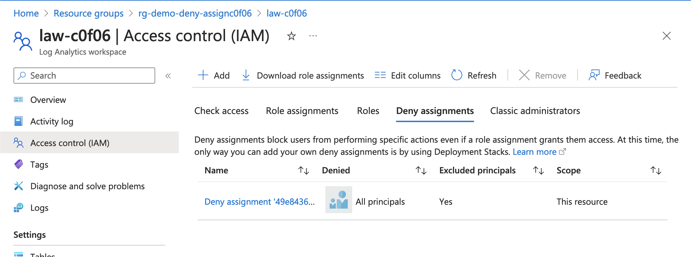

# Exercise 4 - Demonstrating Azure RBAC Deny Assignments

## Updates
12/11/2023 - Initial release

## Overview

In this exercise you will demonstrate [Azure RBAC denyAssignments](https://learn.microsoft.com/en-us/azure/role-based-access-control/deny-assignments)

You observed in [Exercise 1](./exercise1.md) that notActions is not an explicit deny, and a user can perform the action if they have the permission from another assigned role. In [Exercise 2](./exercise2.md) you observed that a user with a privileged permission at the Azure Subscription scope could remove the resource lock allowing the user to circumvent the lock. In [Exercise 3](./exercise3.md) you learned how to use an Azure Policy denyAction to establish an explicit deny to prevent deletion of a resource. However, Azure Policy is limited to denying the [delete action today](https://learn.microsoft.com/en-us/azure/governance/policy/concepts/effects#denyaction-properties).

Azure Policy denyAssignments are a feature of the platform which allows granular selection of which actions to explicitly. As of January 2024, users cannot directly create a denyAssignment. Instead, they are created for [Azure Managed Applications](https://learn.microsoft.com/en-us/azure/azure-resource-manager/managed-applications/overview), [Azure Deployment Stacks](https://learn.microsoft.com/en-us/azure/azure-resource-manager/bicep/deployment-stacks?tabs=azure-powershell), and some Microsoft-managed services.

In this exercise you will create an Azure Deployment Stack that applies a denyAssignment which prevents deletion and modification to a Log Analytics Workspace. It will exclude the permission required to modify diagnostic settings (Microsoft.OperationalInsights/workspaces/providers/Microsoft.Insights/diagnosticSettings/Write) on the Log Analytics Workspace.

The demo user you have created will be assigned the Owner role over the Azure subscription. A resource group and a Log Analytics Workspace will also be created. 

In the first portion of the exercise you will attempt to delete the Log Analytics Workspace to demonstrate the denyAssignment. In the second portion you will modify the diagnostic settings of the Log Analytics Workspace. These activities will demonstrate the flexibility a denyAssignment provides to restrict some actions while allowing others.

The exercise will create the resources illustrated below.


## Pre-requisites
1. You must have an Azure Subscription.

2. You must hold the Owner role on the Azure subscription. This is required because you will be creating role assignments and [registering resource providers](https://learn.microsoft.com/en-us/azure/azure-resource-manager/management/resource-providers-and-types).

3. You must have [Azure CLI](https://learn.microsoft.com/en-us/cli/azure/install-azure-cli) or [Azure PowerShell](https://learn.microsoft.com/en-us/powershell/azure/install-azure-powershell?view=azps-11.1.0) installed. 

    The commands used throughout the exercise using Azure CLI assume the commands are being run from a Bash shell. If using Windows, you can use a Bash shell using the [Windows Subsystem for Linux](https://learn.microsoft.com/en-us/windows/wsl/about).

4. You must create another user in the Entra ID tenant. This will be referred to as the **Demo User** and will be used throughout the exercises. Actions that require the **Demo User** will be labeled as a Demo User action. All other actions should be performed by your user identity that holds the Owner role on the subscription. You will need to record the user principal name of the user identity that you create.

5. You must [assign the **Demo User**](https://learn.microsoft.com/en-us/azure/role-based-access-control/role-assignments-steps) the [Reader role](https://learn.microsoft.com/en-us/azure/role-based-access-control/built-in-roles#reader) at the subscription scope where the resources for this exercise will be deployed.

6. You must define the following variables before running any of the commands in this exercise:

    * **subscription_id** - This is the subscription id the resources will be deployed to. You can obtain the subscription id using the command line options below:

        *Azure CLI*
        ```
        subscription_id=$(az account show --name YOUR_SUBSCRPITION_NAME --query id --output tsv)
        ```
        *Azure PowerShell*
        ```
        $subscription_id=(Get-AzSubscription -SubscriptionName YOUR_SUBSCRIPTION_NAME).SubscriptionId 
        ```

    * **user_object_id** - This is the object id of the Demo User user identity you will use in the exercise. You will need the user principal name for the user you created or requested be created for you prior to starting this exercise. You can obtain the user's object id using the command line options below:

        *Azure CLI*
        ```
        user_object_id=$(az ad user show --id DEMO_USER_UPN --query id --output tsv)
        ```
        *Azure PowerShell*
        ```
        $user_object_id=(Get-AzADUser -UserPrincipalName DEMO_USER_UPN).Id
        ```

    * **object_id** - This is the object id of your user identity. You can obtain your user identity's id using the command line options below:

        *Azure CLI*
        ```
        object_id=$(az ad user show --id YOUR_USER_UPN --query id --output tsv)
        ```
        *Azure PowerShell*
        ```
        $object_id=(Get-AzADUser -UserPrincipalName YOUR_USER_UPN).Id
        ```

    * **location** - This is the location the resources will be deployed to. You can obtain a list of regions available for deployment using the commands below. Ensure that there is no Azure Policy in the Entra ID tenant preventing you from deploying to the selected region.
    
        *Azure CLI*
        ```
        az account list-locations --query "[].name"
        ```

        *Azure PowerShell*
        ```
        Get-AzLocation | Select-Object -ExpandProperty Location 
        ```

## Environment Setup
1. Generate a unique GUID to be used throughout the demo.

    *Azure CLI*
    ```
    unique_guid="$(uuidgen)"
    unique_guid_short=$(echo "${unique_guid::5}" | awk '{print tolower($0)}')
    ```
    *Azure PowerShell*
    ```
    $unique_guid=([guid]::NewGuid()).Guid
    $unique_guid_short=$unique_guid.Substring(0,5) 
    ```

2. Set variables for the resource names.

    *Azure CLI*
    ```
    deployment_stack_name="stack-demo-${unique_guid_short}"
    ```
    *Azure PowerShell*
    ```
    $deployment_stack_name="stack-demo" + $unique_guid_short
    ```

3. Open a Bash shell or PowerShell shell and log into Azure using Azure CLI or Azure PowerShell.

    *Azure CLI*
    ```
    az login
    ```

    *Azure PowerShell*
    ```
    Login-AzAccount
    ```

4. Set the appropriate subscription context.

    *Azure CLI*
    ```
    az account set --id YOUR_SUBSCRIPTION_NAME
    ```
    *Azure PowerShell*
    ```
    Set-AzContext -Subscription YOUR_SUBSCRIPTION_NAME
    ```

5. Create the deployment stack.

    The code below will create a deployment stack at the subscription scope that deploys a Azure RBAC role assignment for the Owner role at the subscription scope for the demo user. It will also create a resource group and Log Analytics Workspace.

    Deny assignments will be created for all the above three resources blocking write and delete actions on the resources except for modifications to the diagnostic settings for the Log Analytics Workspace. Your user identity will be excluded from the deny assignments.

    **NOTE: Before performing this step make sure you are in the exercises directory of this cloned repository. If you are not, the commands below will be unable to find the ARM template in the code directory.**

    *Azure CLI*
    ```
    az stack sub create --name $deployment_stack_name \
    --location $location \
    --description "Sample deny assignment" \
    --template-file "../code/demo_deny_assignment.json" \
    --parameters uniqueGuid=$unique_guid_short location=$location subOwnerObjectId=$user_object_id \
    --deny-settings-apply-to-child-scopes \
    --deny-settings-mode denyWriteAndDelete \
    --deny-settings-excluded-actions "microsoft.insights/diagnosticSettings/write" \
    --deny-settings-excluded-principals $object_id
    ```
    *Azure PowerShell*
    ```
    New-AzSubscriptionDeploymentStack -Name $deployment_stack_name `
    -Location $location `
    -Description "Sample deny assignment" `
    -TemplateFile "../code/demo_deny_assignment.json" `
    -TemplateParameterObject @{uniqueGuid = $unique_guid_short 
    location = $location 
    subOwnerObjectId=$user_object_id}`
    -DenySettingsApplyToChildScopes `
    -DenySettingsMode DenyWriteAndDelete `
    -DenySettingsExcludedAction "microsoft.insights/diagnosticSettings/write" `
    -DenySettingsExcludedPrincipal $object_id
    ```

## Demo - Demonstrate how to review the deny assignments that were created

1. **Demo User Action** Log into the Azure Portal. Navigate to the resource group and select the **Access Control (IAM)** and select the Deny Assignments menu option as seen in the image below.

    

2. **Demo User Action** Select the deny assignment that was created. Navigate to the **Users** blade to review the users the assignment does and does not apply to.

    In the deny assignment pictured below, observe that the deny assignment applies to the [All Principals security principal](https://learn.microsoft.com/en-us/azure/role-based-access-control/deny-assignments#the-all-principals-principal). This princpal includes all users, groups, service principals, and managed identities in the Entra ID tenant. 

    When the deployment stack was created, it used the --deny-settings-excluded-principals command line option. This configures the [excludePrincipals property](https://learn.microsoft.com/en-us/azure/role-based-access-control/deny-assignments#deny-assignment-properties) of the deny assignment to exclude security principals from the deny assignment. Your user identity object id is excluded from this deny assignment.

    

3. **Demo User Action** Navigate to the **Denied Permissions** blade to review the permissions that the deny assignment is denying.

    Observe how the deny assignment is structured in a similar way as a standard RBAC role assignment except the permissions are inverse. Actions listed in the actions property are denied and actions excluded from the deny assignment are listed in the notActions property.

    

4. **Demo User Action** Navigate to the **Properties** blade to review the options available within a deny assignment.

    In the deny assignment pictured below, you can see there are two options for a deny assignment which includes **DOES NOT APPLY TO CHILDREN** and **SYSTEM PROTECTED**. These options are set when the deployment stack is created.

    The **SYSTEM PROTECTED** option maps to the [isSystemDefined property](https://learn.microsoft.com/en-us/azure/role-based-access-control/deny-assignments#deny-assignment-properties) of the deny assignment which indicates the deny assignment was created by the Azure platform. 
    
    The **DOES NOT APPLY TO CHILDREN** option maps to the [doNotApplyToChildScopes property](https://learn.microsoft.com/en-us/azure/role-based-access-control/deny-assignments#deny-assignment-properties) of the deny assignment which controls whether the deny assignment applies to child scopes. The doNotApplyToChildScopes property is by default set to true which means the deny assignment will not affect child resources of that resource the deny assignment is assigned to. 
    
    For example, in this exercise the paramater DenySettingsApplyToChildScopes/deny-settings-apply-to-child-scope was set when creating the deployment stack which set the doNotApplyToChildScopes property to false. This applies the deny assignment to child objects of the Log Analytics Workspaces such as tables. If the **Demo User** attempted to create or delete a table in the Log Analytics Workspace, they would be blocked.

    

## Demo - Demonstrate how deny assigments work

1. **Demo User Action** Log into the Azure Portal. Navigate to the Log Analytics Workspace instance that was created with the demo and select the **Usage and estimated costs** blade and select the **Data Retention** option.

    

    Attempt to change the data retention from 30 days to 90 days. The **Demo User** will be blocked from performing this action by the role assignment even though the **Demo User** has been assigned the built-in Owner role at the subscription scope.

    This demonstrates how a deny assignment can block an action even when the user is granted the action by another role.

    

2. **Demo User Action** Navigate to the **Diagnostic settings** blade of the Log Analytics Workspace. Create a new diagnostic setting. The action will not be denied because the deny assignment excludes the permission **microsoft.insights/diagnosticSettings/write** which is the permission to create new diagnostic settings.

    This demonstrates how a deny assignment can exclude specific actions from its scope so that a user with those permissions granted from another role can perform those actions.

## Cleanup

1. Delete the deployment stack. This command will delete the deployment stack and all resources it created.

    *Azure CLI*
    ```
    az stack sub delete --name $deployment_stack_name --delete-all --yes
    ```
    *Azure PowerShell*
    ```
    Remove-AzSubscriptionDeploymentStack -Name $deployment_stack_name -DeleteAll -Force 
    ```


