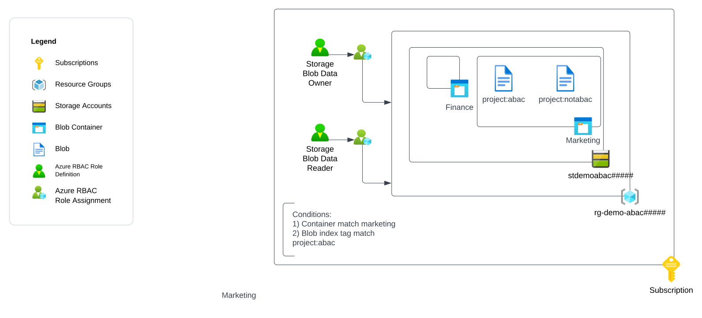
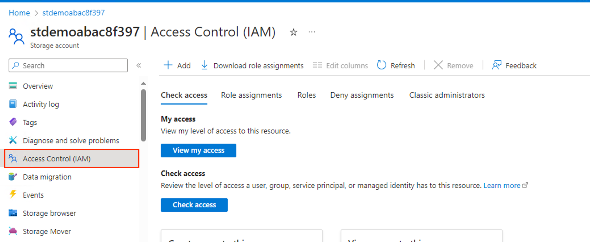
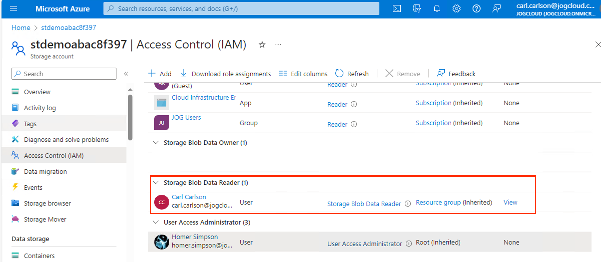
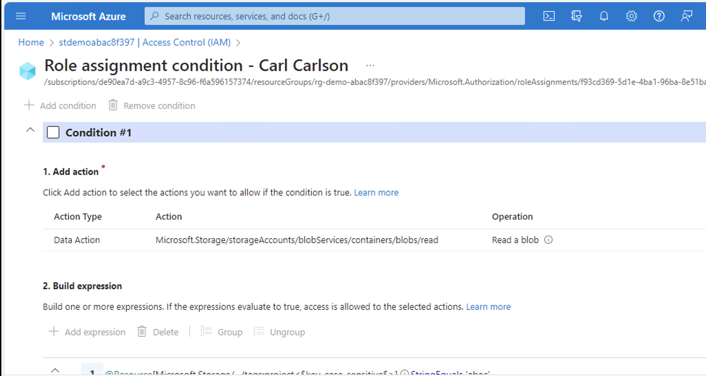
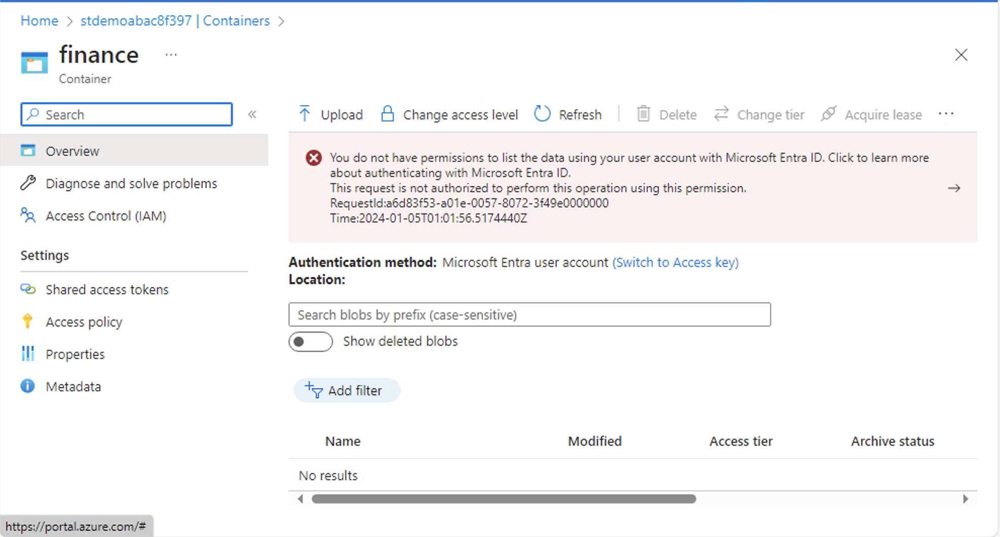
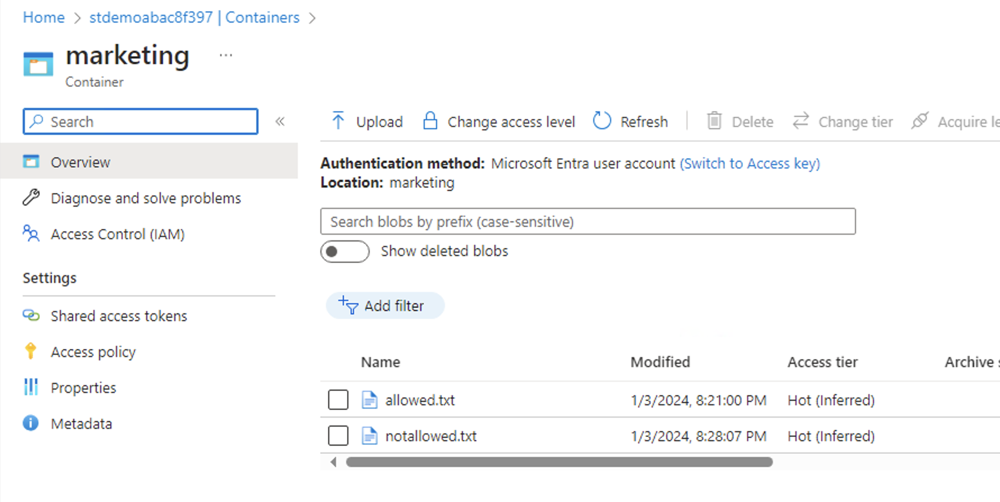
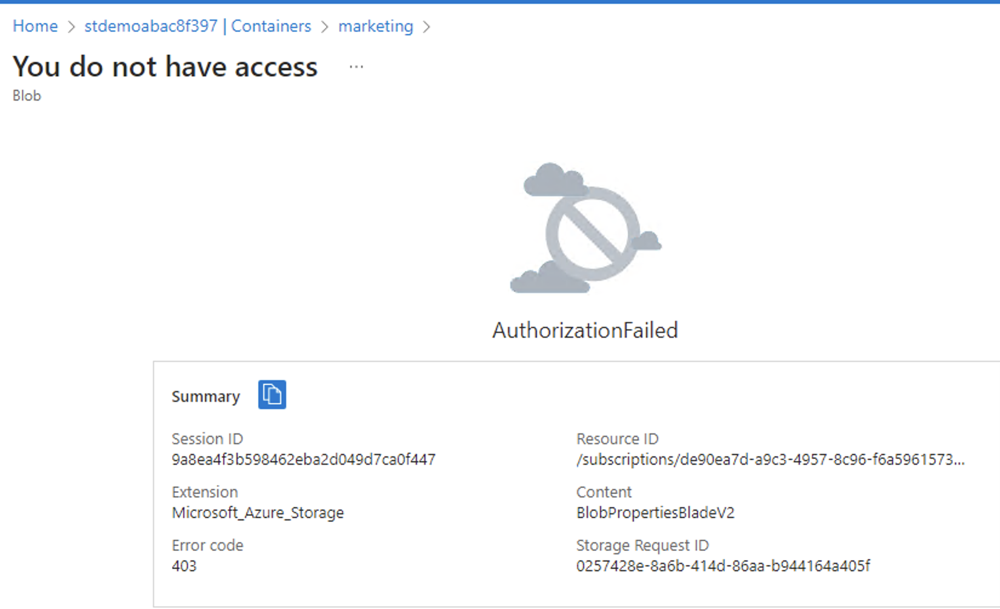

# Exercise 5 - Demonstrating Azure Attribute-Based Access Control

## Updates
12/11/2023 - Initial release

## Overview

In this exercise you will demonstrate [Azure ABAC (Attribute-Based Access Control)](https://learn.microsoft.com/en-us/azure/role-based-access-control/conditions-overview).

You observed in [Exercise 1](./exercise1.md) that notActions is not an explicit deny, and a user can perform the action if they have the permission from another assigned role. In [Exercise 2](./exercise2.md) you observed that a user with a privileged permission at the Azure Subscription scope could remove the resource lock allowing the user to circumvent the lock. In [Exercise 3](./exercise3.md) you learned how to use an Azure Policy denyAction to establish an explicit deny for delete operations. In [Exercise 4](./exercise4.md) you learned how Azure RBAC denyAssignments can provide granularity to explicit denies, but are currently limited to be created indirectly through [Azure Deployment Stacks](https://learn.microsoft.com/en-us/azure/azure-resource-manager/bicep/deployment-stacks?tabs=azure-powershell) and [Azure Managed Applications](https://learn.microsoft.com/en-us/azure/azure-resource-manager/managed-applications/overview).

With the exception of the Azure Policy denyAction feature, the features covered above authorize the user based on the direct user's unique identifier. Azure offers an additional feature called Azure ABAC which can authorize the user based on [attributes of the user, the user's environment, or attributes of the resource the user is attempting to access](https://learn.microsoft.com/en-us/azure/role-based-access-control/conditions-format#attributes). Currently, this is [limited to Azure Storage for blobs and queues](https://learn.microsoft.com/en-us/azure/role-based-access-control/conditions-format#actions).

In this exercise you will create an Azure Storage Account with two containers. One container will be named Marketing and one will be named Finance. The Marketing container will contain two blobs which will be tagged with different [blob index tags](https://learn.microsoft.com/en-us/azure/storage/blobs/storage-blob-index-how-to?tabs=azure-portal). 

You will create a role assignment with a condition to limit the **Demo User** to the Marketing container only with an additional restriction of blobs with an index tag key of project and value of abac. You will then attempt to access these resoruces to demonstrate the ABAC feature.

The exercise will create the resources illustrated below.



## Pre-requisites
1. You must have an Azure Subscription.

2. You must hold the Owner role on the Azure subscription. This is required because you will be creating role assignments and [registering resource providers](https://learn.microsoft.com/en-us/azure/azure-resource-manager/management/resource-providers-and-types).

3. You must have [Azure CLI](https://learn.microsoft.com/en-us/cli/azure/install-azure-cli) or [Azure PowerShell](https://learn.microsoft.com/en-us/powershell/azure/install-azure-powershell?view=azps-11.1.0) installed. 

    The commands used throughout the exercise using Azure CLI assume the commands are being run from a Bash shell. If using Windows, you can use a Bash shell using the [Windows Subsystem for Linux](https://learn.microsoft.com/en-us/windows/wsl/about).

4. You must create another user in the Entra ID tenant. This will be referred to as the **Demo User** and will be used throughout the exercises. Actions that require the **Demo User** will be labeled as a Demo User action. All other actions should be performed by your user identity that holds the Owner role on the subscription. You will need to record the user principal name of the user identity that you create.

5. You must [assign the **Demo User**](https://learn.microsoft.com/en-us/azure/role-based-access-control/role-assignments-steps) the [Reader role](https://learn.microsoft.com/en-us/azure/role-based-access-control/built-in-roles#reader) at the subscription scope where the resources for this exercise will be deployed.

6. You must define the following variables before running any of the commands in this exercise:

    * **subscription_id** - This is the subscription id the resources will be deployed to. You can obtain the subscription id using the command line options below:

        *Azure CLI*
        ```
        subscription_id=$(az account show --name YOUR_SUBSCRPITION_NAME --query id --output tsv)
        ```
        *Azure PowerShell*
        ```
        $subscription_id=(Get-AzSubscription -SubscriptionName YOUR_SUBSCRIPTION_NAME).SubscriptionId 
        ```

    * **user_object_id** - This is the object id of the Demo User user identity you will use in the exercise. You will need the user principal name for the user you created or requested be created for you prior to starting this exercise. You can obtain the user's object id using the command line options below:

        *Azure CLI*
        ```
        user_object_id=$(az ad user show --id DEMO_USER_UPN --query id --output tsv)
        ```
        *Azure PowerShell*
        ```
        $user_object_id=(Get-AzADUser -UserPrincipalName DEMO_USER_UPN).Id
        ```

    * **object_id** - This is the object id of your user identity. You can obtain your user identity's id using the command line options below:

        *Azure CLI*
        ```
        object_id=$(az ad user show --id YOUR_USER_UPN --query id --output tsv)
        ```
        *Azure PowerShell*
        ```
        $object_id=(Get-AzADUser -UserPrincipalName YOUR_USER_UPN).Id
        ```

    * **location** - This is the location the resources will be deployed to. You can obtain a list of regions available for deployment using the commands below. Ensure that there is no Azure Policy in the Entra ID tenant preventing you from deploying to the selected region.
    
        *Azure CLI*
        ```
        az account list-locations --query "[].name"
        ```

        *Azure PowerShell*
        ```
        Get-AzLocation | Select-Object -ExpandProperty Location 
        ```


## Environment Setup
1. Generate a unique GUID to be used throughout the demo.

    *Azure CLI*
    ```
    unique_guid="$(uuidgen)"
    unique_guid_short=$(echo "${unique_guid::5}" | awk '{print tolower($0)}')
    ```
    *Azure PowerShell*
    ```
    $unique_guid=([guid]::NewGuid()).Guid
    $unique_guid_short=$unique_guid.Substring(0,5) 
    ```

2. Set variables for the resource names.

    *Azure CLI*
    ```
    resource_group_name="rg-demo-rbac-abac${unique_guid_short}"
    storage_account_name="stdemoabac${unique_guid_short}"
    allowed_file_name="allowed.txt"
    notallowed_file_name="notallowed.txt"
    container_name_allowed="marketing"
    container_name_notallowed="finance"
    ```
    *Azure PowerShell*
    ```
    $resource_group_name = "rg-demo-rbac-abac" + $unique_guid_short
    $storage_account_name="stdemoabac" + $unique_guid_short
    $allowed_file_name="allowed.txt"
    $notallowed_file_name="notallowed.txt"
    $container_name_allowed="marketing"
    $container_name_notallowed="finance"
    ```

3. Create a resource group.
    
    *Azure CLI*
    ```
    az group create --name $resource_group_name --location $location
    ```

    *Azure PowerShell*
    ```
    New-AzResourceGroup -Name $resource_group_name -Location $location 
    ```

4. Create the storage account.

    *Azure CLI*
    ```
    az storage account create --name $storage_account_name \
    --resource-group $resource_group_name \
    --location $location --sku Standard_LRS \
    --allow-shared-key-access false
    ```

    *Azure PowerShell*
    ```
    New-AzStorageAccount -Name $storage_account_name `
    -ResourceGroupName $resource_group_name `
    -Location $location `
    -SkuName Standard_LRS `
    -AllowSharedKeyAccess $False
    ```

5. Create a role assignment for the built-in Storage Blob Data Owner role and assign it to your user identity. This role will grant you full access to the data plane of blob storage for the Azure Storage Account.

    *Azure CLI*
    ```
    az role assignment create --role "Storage Blob Data Owner" \
    --assignee-object-id $object_id \
    --scope "/subscriptions/$subscription_id/resourceGroups/$resource_group_name" \
    --assignee-principal-type User
    ```

    *Azure PowerShell*
    ```
    New-AzRoleAssignment -ObjectId $object_id -RoleDefinitionName "Storage Blob Data Owner" -Scope "/subscriptions/$subscription_id/resourceGroups/$resource_group_name"
    ```

6. Create a role assignment for the built-in Storage Blob Data Reader role and assign it to the **Demo User** identity. This role will grant the **Demo User** the read access to the data plane of blob storage for the Azure Storage Account. It will include two conditions to limit the access to the Marketing container and blobs with a blob index tag of project and value of abac.

    *Azure CLI*
    ```
    az role assignment create --role "Storage Blob Data Reader" \
    --assignee-object-id $user_object_id \
    --scope "/subscriptions/$subscription_id/resourceGroups/$resource_group_name" \
    --condition "
    (
        (
            !(
                ActionMatches{'Microsoft.Storage/storageAccounts/blobServices/containers/blobs/read'} 
                AND NOT SubOperationMatches{'Blob.List'}
            )
        ) 
        OR 
        (
            @Resource[Microsoft.Storage/storageAccounts/blobServices/containers/blobs/tags:project<\$key_case_sensitive\$>] StringEquals 'abac'
        )
    )
    AND
    (
        (
            !(
                ActionMatches{'Microsoft.Storage/storageAccounts/blobServices/containers/blobs/read'} 
                AND SubOperationMatches{'Blob.List'}
            )   
        )
        OR 
        (
            @Resource[Microsoft.Storage/storageAccounts/blobServices/containers:name] StringEqualsIgnoreCase 'marketing'
        )
    )" \
    --condition-version "2.0" \
    --assignee-principal-type User
    ```

    *Azure PowerShell*
    ```
    New-AzRoleAssignment -ObjectId $user_object_id `
    -RoleDefinitionName "Storage Blob Data Reader" `
    -Scope "/subscriptions/$subscription_id/resourceGroups/$resource_group_name" `
    -Condition "(
        (
            !(
                ActionMatches{'Microsoft.Storage/storageAccounts/blobServices/containers/blobs/read'} 
                AND NOT SubOperationMatches{'Blob.List'}
            )
        ) 
        OR 
        (
            @Resource[Microsoft.Storage/storageAccounts/blobServices/containers/blobs/tags:project<`$key_case_sensitive`$>] StringEquals 'abac'
        )
    )
    AND
    (
        (
            !(
                ActionMatches{'Microsoft.Storage/storageAccounts/blobServices/containers/blobs/read'} 
                AND SubOperationMatches{'Blob.List'}
            )   
        )
        OR 
        (
            @Resource[Microsoft.Storage/storageAccounts/blobServices/containers:name] StringEqualsIgnoreCase 'marketing'
        )
    )" `
    -ConditionVersion "2.0"
    ```

7. Create a container named Marketing which the **Demo User** will be able to access.

    *Azure CLI*
    ```
    az storage container create --name $container_name_allowed \
    --account-name $storage_account_name \
    --auth-mode login
    ```
    *Azure PowerShell*
    ```
    $storage_context = New-AzStorageContext -StorageAccountName $storage_account_name `
    -UseConnectedAccount

    New-AzStorageContainer -Name $container_name_allowed" `
    -Context $storage_context
    ```
8. Create a container named Finance which the **Demo User** will not be able to access.

    *Azure CLI*
    ```
    az storage container create --name $container_name_notallowed \
    --account-name $storage_account_name \
    --auth-mode login
    ```
    *Azure PowerShell*
    ```
    $storage_context = New-AzStorageContext -StorageAccountName $storage_account_name `
    -UseConnectedAccount

    New-AzStorageContainer -Name $container_name_notallowed" `
    -Context $storage_context
    ```

9. Create a sample text file the **Demo User** will be able to access.

    *Azure CLI*
    ```
    echo 'You are authorized!' > $allowed_file_name
    az storage blob upload --container-name $container_name_allowed \
    --account-name $storage_account_name \
    --file $allowed_file_name --name $allowed_file_name \
    --tags "project=abac" \
    --auth-mode login
    ```
    *Azure PowerShell*
    ```
    $storage_context = New-AzStorageContext -StorageAccountName $storage_account_name -UseConnectedAccount

    "You are authorized" | Out-File $allowed_file_name

    Set-AzStorageBlobContent -File $allowed_file_name `
    -Container $container_name_allowed `
    -Blob $allowed_file_name `
    -Context $storage_context `
    -Tag @{project="abac"} 

    ```

10. Create a sample text file the **Demo User** will not be able to access.

    *Azure CLI*
    ```
    echo 'You are not authorized!' > $notallowed_file_name
    az storage blob upload --container-name $container_name_allowed \
    --account-name $storage_account_name \
    --file $notallowed_file_name --name $notallowed_file_name \
    --tags "project=notabac" \
    --auth-mode login
    ```
    *Azure PowerShell*
    ```
    $storage_context = New-AzStorageContext -StorageAccountName $storage_account_name -UseConnectedAccount

    "You are not authorized" | Out-File $notallowed_file_name

    Set-AzStorageBlobContent -File $notallowed_file_name `
    -Container $container_name_allowed `
    -Blob $notallowed_file_name `
    -Context $storage_context `
    -Tag @{project="notabac"} 
    ```
## Demo - Observe ABAC Behavior

1. **Demo User Action** Log into the Azure Portal and navigate to the storage account you created. Open the **Access Control (IAM)** blade as seen in the image below.

    

2. **Demo User Action** Navigate to the **Role assignments** section and view the role assignment created for the **Demo User**.

    

3. **Demo User Action** When viewing the role assignment you will see the graphical tool to build the conditions. It's recommended to use the graphical tool to build your conditions and then to export the code to your infrastructure-as-code.

    

    There are two conditions in the role assignment. One condition limits the **Demo User** to the Marketing container. The other condition limits the user to blobs with a blox index tag key of project and value of abac.

    The code is presented below.


    ```
    (
        (
            !(ActionMatches{'Microsoft.Storage/storageAccounts/blobServices/containers/blobs/read'} AND NOT SubOperationMatches{'Blob.List'})
        )
        OR 
        (
        @Resource[Microsoft.Storage/storageAccounts/blobServices/containers/blobs/tags:project<$key_case_sensitive$>] StringEquals 'abac'
        )
    )
    AND
    (
        (
            !(ActionMatches{'Microsoft.Storage/storageAccounts/blobServices/containers/blobs/read'} AND SubOperationMatches{'Blob.List'})
        )
        OR 
        (
            @Resource[Microsoft.Storage/storageAccounts/blobServices/containers:name] StringEqualsIgnoreCase 'marketing'
        )
    )
    ```

4. **Demo User Action** Navigate to the **Containers** blade of the storage account. Attempt to view the finance container. Even though the **Demo User** has been assigned the Storage Blob Data Reader role, the user will be denied when attempting to view the contents of the container. This occurs because the condition limits the user to the marketing container.

    

5. **Demo User Action** Attempt to view the marketing container. The **Demo User** will be able to view the contents of the marketing container because the condition allows for that.

    

6. **Demo User Action** Attempt to select the notallowed.txt blob. The **Demo User** will be denied with the error below. This is because this blob has a blob index tag with a key of project and a tag of notabac. The condition applied to the role assignment limits the user to blobs with blob index tags with a key of project and tag of abac.

    

7. **Demo User Action** Attempt to select the allowed.txt blob. The **Demo User** will be allowed access to the file. Download the file and read the context. The access is allowed because the blob is tagged with a blob index tag with a key of project and value of abac. This matches the role assignment condition so the access is allowed.

## Cleanup

1. Delete the resource group.
    
    *Azure CLI*
    ```
    az group delete --name $resource_group_name --yes
    ```
    *Azure PowerShell*
    ```
    Remove-AzResourceGroup -Name $resource_group_name -Force


