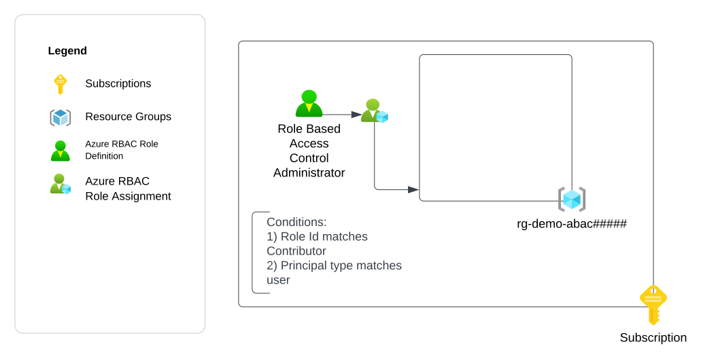
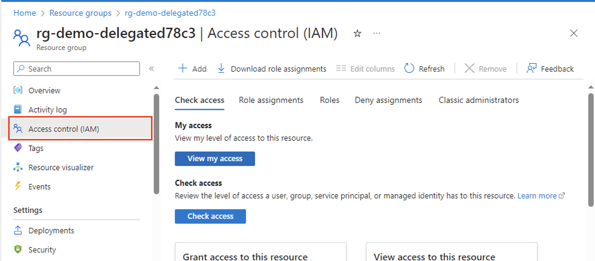
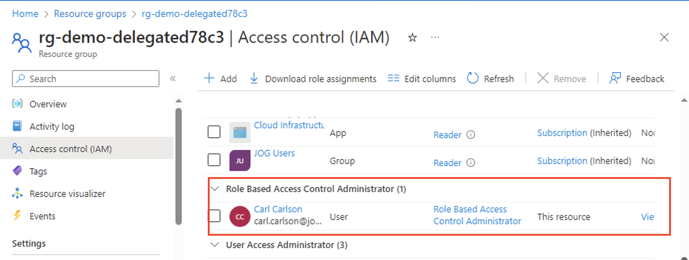
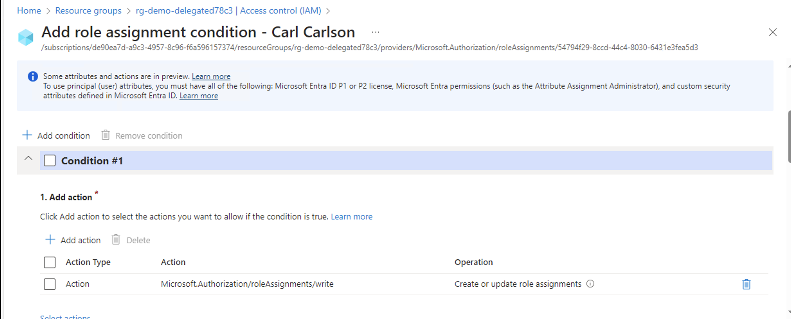
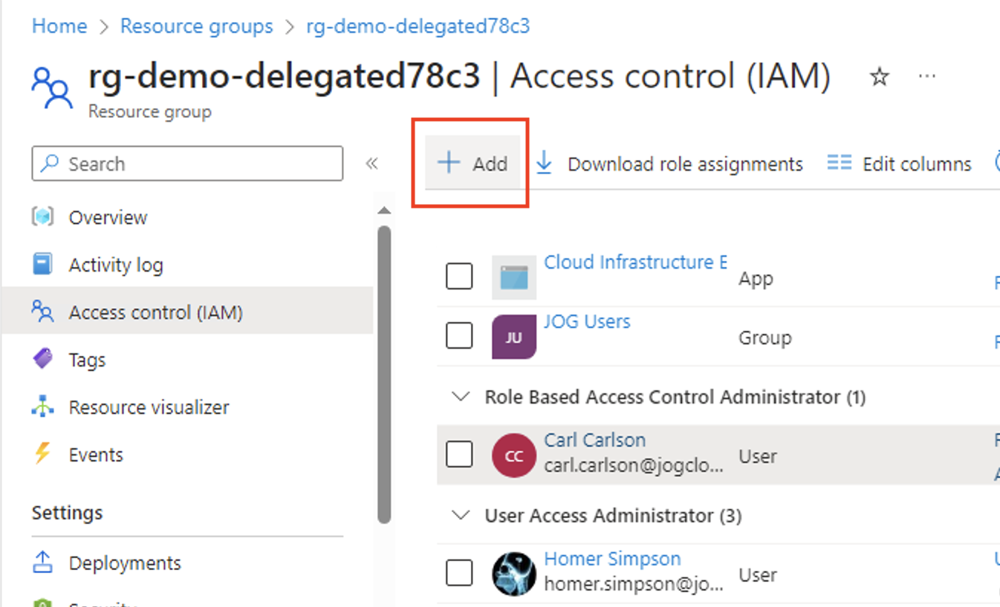
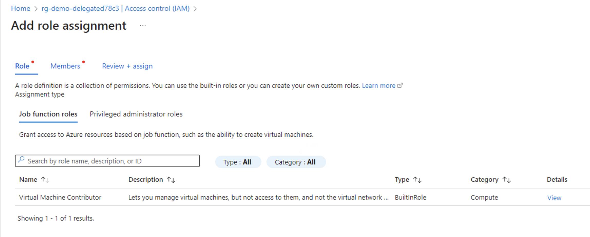
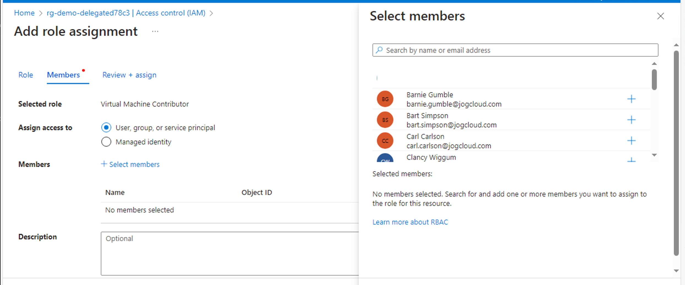

# Exercise 6 - Demonstrating Delegation of Azure RBAC Role Assignment to Human Users with Conditions

## Updates
12/11/2023 - Initial release

## Overview

In this exercise you will demonstrate how to [delegate Azure RBAC role assignment to another user with conditions](https://learn.microsoft.com/en-us/azure/role-based-access-control/delegate-role-assignments-overview?tabs=template).

You user identity is able to create role assignments because it has been assigned the built-in Owner role over the subscription or management group the subscription is within. [Owner](https://learn.microsoft.com/en-us/azure/role-based-access-control/resource-provider-operations#microsoftauthorization) and [User Access Administrator](https://learn.microsoft.com/en-us/azure/role-based-access-control/built-in-roles#user-access-administrator) are the only two built-in Azure RBAC roles that have the necessary permissions ([Microsoft.Authorization/*](https://learn.microsoft.com/en-us/azure/role-based-access-control/resource-provider-operations#microsoftauthorization)) to create, update, and delete Azure RBAC role assignments. These roles, and the permissions granted to them, are considered the most highly privileged permissions in Azure. 

It is common for organizations to operate in highly democratized environments where business units may require the freedom to create, update, and delete role assignments without the involvement of central IT. When assigning a user a custom or built-in role with the Microsft.Authorization/* permissions, the user is able to create, update, and delete role assignments for any Azure RBAC Role and security principal (user, group, service principal, managed identity) within the scope (management group, subscription, resource group, resource) the role assignment was created. This does not align with the principle of least privilege.

Role assignment [conditions](https://learn.microsoft.com/en-us/azure/role-based-access-control/conditions-authorization-actions-attributes) can be used to establish guardrails around how a security principal can exercise its privileged permissions. These guardrails can limit which role assignments can be create, updated, and deleted based on:

* Role definition id(s)
* Security principal ids(s)
* Security principal types
* Authorization Actions (Write or Delete)

In this exercise you will create an empty resource group. You will assign an Azure RBAC role assignment for the [Role Based Access Control Administrator](https://learn.microsoft.com/en-us/azure/role-based-access-control/delegate-role-assignments-overview?tabs=template#role-based-access-control-administrator-role) built-in role that has conditions which limit the **Demo User** to creating new role assignments to the [Virtual Machine Contributor](https://learn.microsoft.com/en-us/azure/role-based-access-control/built-in-roles#virtual-machine-contributor) built-in Azure RBAC Role. The role assignment will have an additional condition which limits the role assignments creation and deletion to role assignments for principals of type user.

You will then attempt to create new role assignments with the **Demo User** to demonstrate the conditions. 

The exercise will create the resources illustrated below.



## Pre-requisites
1. You must have an Azure Subscription.

2. You must hold the Owner role on the Azure subscription. This is required because you will be creating role assignments and [registering resource providers](https://learn.microsoft.com/en-us/azure/azure-resource-manager/management/resource-providers-and-types).

3. You must have [Azure CLI](https://learn.microsoft.com/en-us/cli/azure/install-azure-cli) or [Azure PowerShell](https://learn.microsoft.com/en-us/powershell/azure/install-azure-powershell?view=azps-11.1.0) installed. 

    The commands used throughout the exercise using Azure CLI assume the commands are being run from a Bash shell. If using Windows, you can use a Bash shell using the [Windows Subsystem for Linux](https://learn.microsoft.com/en-us/windows/wsl/about).

4. You must create another user in the Entra ID tenant. This will be referred to as the **Demo User** and will be used throughout the exercises. Actions that require the **Demo User** will be labeled as a Demo User action. All other actions should be performed by your user identity that holds the Owner role on the subscription. You will need to record the user principal name of the user identity that you create.

5. You must [assign the **Demo User**](https://learn.microsoft.com/en-us/azure/role-based-access-control/role-assignments-steps) the [Reader role](https://learn.microsoft.com/en-us/azure/role-based-access-control/built-in-roles#reader) at the subscription scope where the resources for this exercise will be deployed.

6. You must define the following variables before running any of the commands in this exercise:

    * **subscription_id** - This is the subscription id the resources will be deployed to. You can obtain the subscription id using the command line options below:

        *Azure CLI*
        ```
        subscription_id=$(az account show --name YOUR_SUBSCRPITION_NAME --query id --output tsv)
        ```
        *Azure PowerShell*
        ```
        $subscription_id=(Get-AzSubscription -SubscriptionName YOUR_SUBSCRIPTION_NAME).SubscriptionId 
        ```

    * **user_object_id** - This is the object id of the Demo User user identity you will use in the exercise. You will need the user principal name for the user you created or requested be created for you prior to starting this exercise. You can obtain the user's object id using the command line options below:

        *Azure CLI*
        ```
        user_object_id=$(az ad user show --id DEMO_USER_UPN --query id --output tsv)
        ```
        *Azure PowerShell*
        ```
        $user_object_id=(Get-AzADUser -UserPrincipalName DEMO_USER_UPN).Id
        ```

    * **location** - This is the location the resources will be deployed to. You can obtain a list of regions available for deployment using the commands below. Ensure that there is no Azure Policy in the Entra ID tenant preventing you from deploying to the selected region.
    
        *Azure CLI*
        ```
        az account list-locations --query "[].name"
        ```

        *Azure PowerShell*
        ```
        Get-AzLocation | Select-Object -ExpandProperty Location 
        ```


## Environment Setup
1. Generate a unique GUID to be used throughout the demo.

    *Azure CLI*
    ```
    unique_guid="$(uuidgen)"
    unique_guid_short=$(echo "${unique_guid::5}" | awk '{print tolower($0)}')
    ```
    *Azure PowerShell*
    ```
    $unique_guid=([guid]::NewGuid()).Guid
    $unique_guid_short=$unique_guid.Substring(0,5) 
    ```

2. Set variables for the resource names.

    *Azure CLI*
    ```
    resource_group_name="rg-demo-rbac-delegate${unique_guid_short}"
    ```
    *Azure PowerShell*
    ```
    $resource_group_name = "rg-demo-rbac-delegate" + $unique_guid_short
    ```

3. Create a resource group.
    
    *Azure CLI*
    ```
    az group create --name $resource_group_name --location $location
    ```

    *Azure PowerShell*
    ```
    New-AzResourceGroup -Name $resource_group_name -Location $location 
    ```

6. Create a role assignment for the built-in Role Based Access Control Administrator role and assign it to the **Demo User** identity. This role will grant the **Demo User** the permissions to create role assignments, but with the condition that the role assignment is the Contributor role and that the assignee is principal type is a user.

    *Azure CLI*
    ```
    az role assignment create --role "Role Based Access Control Administrator" \
    --assignee-object-id $user_object_id \
    --scope "/subscriptions/$subscription_id/resourceGroups/$resource_group_name" \
    --condition "(
        (
            !(ActionMatches{'Microsoft.Authorization/roleAssignments/write'})
        )
        OR 
        (
            @Request[Microsoft.Authorization/roleAssignments:RoleDefinitionId] ForAnyOfAnyValues:GuidEquals {9980e02c-c2be-4d73-94e8-173b1dc7cf3c}
            AND
            @Request[Microsoft.Authorization/roleAssignments:PrincipalType] StringEqualsIgnoreCase 'User'
        )
    )
    AND
    (
        (
            !(ActionMatches{'Microsoft.Authorization/roleAssignments/delete'})
        )
        OR 
        (
            @Resource[Microsoft.Authorization/roleAssignments:RoleDefinitionId] ForAnyOfAnyValues:GuidEquals {9980e02c-c2be-4d73-94e8-173b1dc7cf3c}
            AND
            @Request[Microsoft.Authorization/roleAssignments:PrincipalType] StringEqualsIgnoreCase 'User'
        )
    )" \
    --condition-version "2.0" \
    --assignee-principal-type User
    ```

    *Azure PowerShell*
    ```
    New-AzRoleAssignment -ObjectId $user_object_id `
    -RoleDefinitionName "Storage Blob Data Reader" `
    -Scope "/subscriptions/$subscription_id/resourceGroups/$resource_group_name" `
    -Condition "(
        (
            !(ActionMatches{'Microsoft.Authorization/roleAssignments/write'})
        )
        OR 
        (
            @Request[Microsoft.Authorization/roleAssignments:RoleDefinitionId] ForAnyOfAnyValues:GuidEquals {9980e02c-c2be-4d73-94e8-173b1dc7cf3c}
            AND
            @Request[Microsoft.Authorization/roleAssignments:PrincipalType] StringEqualsIgnoreCase 'User'
        )
    )
    AND
    (
        (
            !(ActionMatches{'Microsoft.Authorization/roleAssignments/delete'})
        )
        OR 
        (
            @Resource[Microsoft.Authorization/roleAssignments:RoleDefinitionId] ForAnyOfAnyValues:GuidEquals {9980e02c-c2be-4d73-94e8-173b1dc7cf3c}
            AND
            @Request[Microsoft.Authorization/roleAssignments:PrincipalType] StringEqualsIgnoreCase 'User'
        )
    )" `
    -ConditionVersion "2.0"
    ```


## Demo - Observe Delegation Behavior

1. **Demo User Action** Log into the Azure Portal and navigate to the resource group you create. Open the **Access Control (IAM)** blade as seen in the image below.

    

2. **Demo User Action** Navigate to the **Role assignments** section and view the role assignment created for the **Demo User**.

    

3. **Demo User Action** When viewing the role assignment you will see the graphical tool to build the conditions. It's recommended to use the graphical tool to build your conditions and then to export the code to your infrastructure-as-code.

    

    There are two conditions in the role assignment and each condition has two expressions. The first condition limits the **Demo User** when creating role assignments and the second condition limits the deletion of role assignments. The expressions limit the user to creation or deletion of role assignments only when the role id matches the built-in Contributor role and the principal type is a user.

    The code is presented below.

    ```
    (
        (
            !(ActionMatches{'Microsoft.Authorization/roleAssignments/write'})
        )
        OR 
        (
            @Request[Microsoft.Authorization/roleAssignments:RoleDefinitionId] ForAnyOfAnyValues:GuidEquals {9980e02c-c2be-4d73-94e8-173b1dc7cf3c}
            AND
            @Request[Microsoft.Authorization/roleAssignments:PrincipalType] StringEqualsIgnoreCase 'User'
        )
    )
    AND
    (
        (
            !(ActionMatches{'Microsoft.Authorization/roleAssignments/delete'})
        )
        OR 
        (
            @Resource[Microsoft.Authorization/roleAssignments:RoleDefinitionId] ForAnyOfAnyValues:GuidEquals {9980e02c-c2be-4d73-94e8-173b1dc7cf3c}
            AND
            @Request[Microsoft.Authorization/roleAssignments:PrincipalType] StringEqualsIgnoreCase 'User'
        )
    )
    ```
4. **Demo User Action** Navigate back to the **Access Control (IAM)** blade. Select the option to add a new role assignment.

    

5. **Demo User Action** In the new role assignment window, you will notice there is Virtual Machine Contributor is the only role the **Demo User** can assign. This is due to this expression in the role assignment condition.

    ```
    @Request[Microsoft.Authorization/roleAssignments:RoleDefinitionId] ForAnyOfAnyValues:GuidEquals {9980e02c-c2be-4d73-94e8-173b1dc7cf3c}
    ```

    

6. **Demo User Action** Select the Virtual Machine Contributor role and advance to the **Members** menu. When attempting to add a member to the role you will observe only Users are available. This is due to this expression in the role assignment condition:

    ```
    @Request[Microsoft.Authorization/roleAssignments:PrincipalType] StringEqualsIgnoreCase 'User'
    ```

    

## Cleanup

1. Delete the resource group.
    
    *Azure CLI*
    ```
    az group delete --name $resource_group_name --yes
    ```
    *Azure PowerShell*
    ```
    Remove-AzResourceGroup -Name $resource_group_name -Force


